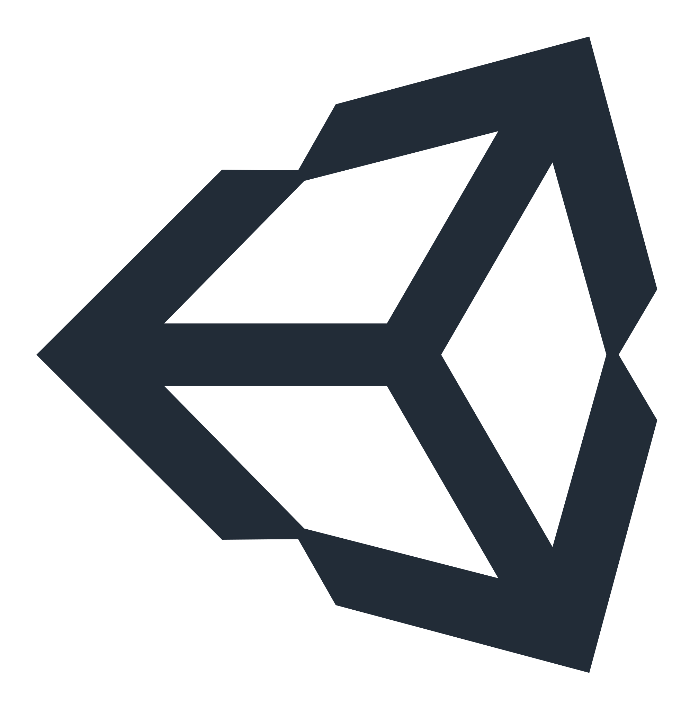
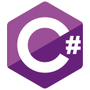
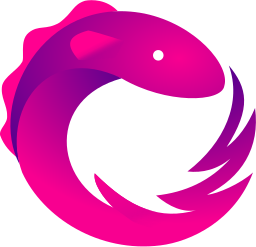
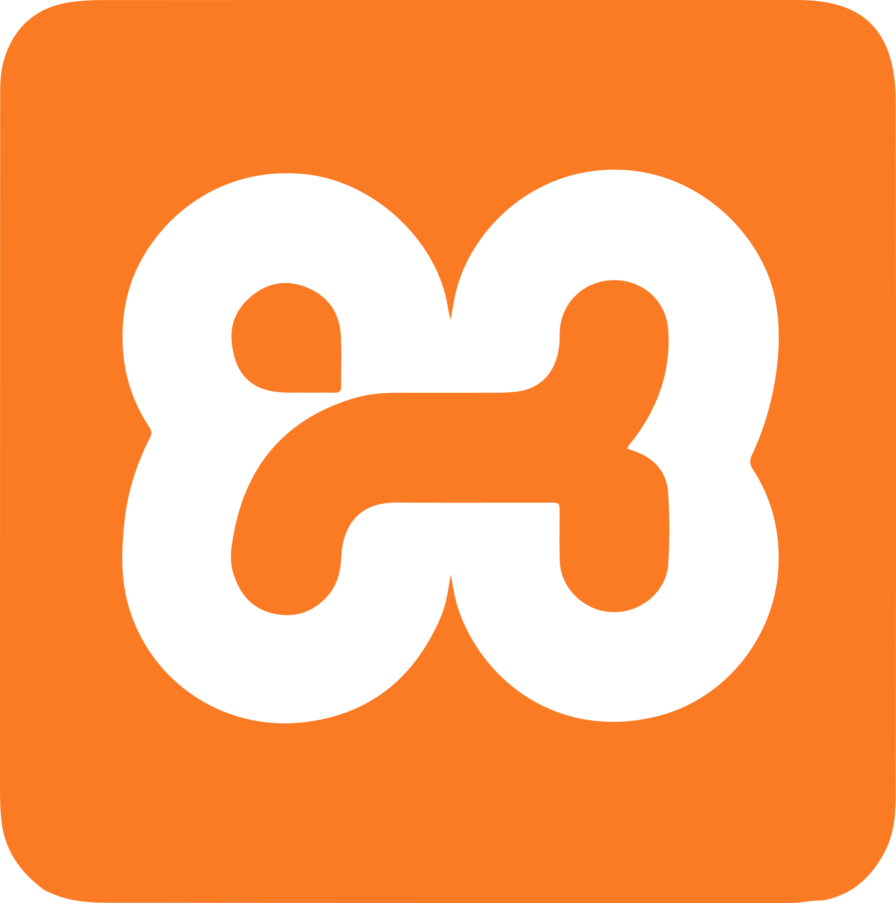
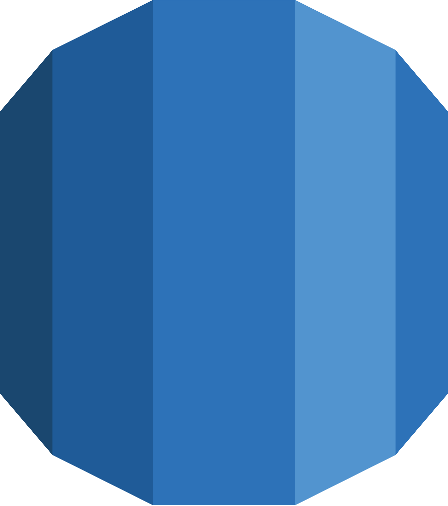
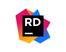
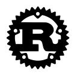

## Hi! 👋🏻 I'm Paulo Salvatore :)

  
  
  
  

<!--

  
  

-->

  
  

### 📺 Latest YouTube Videos (PT-BR)

<!-- YOUTUBE:START -->
- [Venha comecar do ZERO! 🤝  #backend #javascript #backenddeveloper](https://www.youtube.com/watch?v=jya6MOD9_Jw)
- [Contagem regressiva ...  Você não pode acreditar no que te espera!  ✨ #backend #javascript](https://www.youtube.com/watch?v=aBN5ao0BY7g)
- [🫵 Crie a sua experiência! #podcast  #tecnologia #programming](https://www.youtube.com/watch?v=Y0vYsRQSXW4)
- [Não percam nos dias 17, 18 e 19/10, 18h às 19h30. A &quot;Semana de Back-End e JavaScript&quot;](https://www.youtube.com/watch?v=G7BBPjmxvpg)
- [Semana de Backend JavaScript: Dia 3](https://www.youtube.com/watch?v=a-SEYaRS4w8)
<!-- YOUTUBE:END -->

➡️ [more videos...](https://youtube.com/PauloSalvatore)

<!-- BIO:START -->

### Who am I?

<small>EN-US</small>

👨🏻‍🏫 Professor and CEO at Salvatore.Academy, revolutionizing tech education through gamified, real-world experiences.

🌎 Former CTO & Co-founder at Virtual Planet, a California-based startup focused on climate change through immersive tech.

💻 10+ years in software & game dev. Specialized in VR, AI, and AR. Developed for Oculus Rift, Go, and Quest.

📚 Faculty at FIAP and Samsung’s Ocean, teaching VR, AI, Android dev, Games, and AR.

🌐 Active on GitHub with an international profile, contributing to open-source projects and tech innovation.

<small>PT-BR</small>

👨🏻‍🏫 Professor e desenvolvedor, comecei a ~~programar~~ copiar e colar código aos ~12 anos,
criando os [meus próprios](https://github.com/paulosalvatore/maruim_server) servidores de Tibia, o famoso otzinho pra quem pegou essa fase.

🧑🏻‍💻 Iniciei a faculdade em 2016, aos 22, tive o meu primeiro emprego como dev aos 23, e me tornei CTO aos 24. Atuando como professor desde
2017, estou sempre em busca de compartilhar o conhecimento que adquiri ao longo dessa [jornada](https://www.linkedin.com/in/salvatorepaulo/details/experience/).
Atualmente sou professor e CEO da [Salvatore.Academy](https://salvatore.academy/), uma escola de tecnologia que ensina a criar sites, apps ou games. Também atuo no [Samsung Ocean](https://oceanbrasil.com/) e faço parte da [FIAP](https://www.fiap.com.br/), na graduação
de [Jogos Digitais](https://www.fiap.com.br/graduacao/tecnologo/jogos-digitais/) e no MBA de [Gestão da TI](https://www.fiap.com.br/mba/mba-em-gestao-da-tecnologia-da-informacao/).

📙 Escritor na Casa do Código, onde [publiquei](https://www.casadocodigo.com.br/products/livro-android-nativo) o meu primeiro
livro "Android nativo com Kotlin e MVVM: Simplificando técnicas avançadas", introduzindo o universo
do [DevMon](https://fabricadesinapse.github.io/DevMon/).

🏫 MBA em gestão estratégica de negócios e Graduação em  Digitais pela FIAP. Colaborei em um [artigo científico](https://www.mdpi.com/2073-4441/13/9/1142)
publicado na revista [Water](https://www.mdpi.com/), sobre usar realidade virtual no planejamento da mudança climática.

🌎 Em 2018, cofundei e me tornei CTO da [Virtual Planet](https://virtualplanet.tech/), startup localizada na Califórnia que utiliza tecnologias
imersivas como realidade virtual para comunicar melhor os problemas relacionados à mudança climática.

🔮 Atualmente estou em busca de ampliar os meus [projetos de educação](https://salvatore.academy) e adquirir novas experiências no mundo da programação.
Meu sonho é conseguir commitar em alguns projetos de código aberto que estão sempre no meu dia a dia, já
consegui [um pouquinho](https://github.com/nestjs/docs.nestjs.com/pulls?q=is%3Apr+is%3Aclosed+author%3Apaulosalvatore)
com o [Nest.js](https://nestjs.com/), mas por enquanto só no projeto da documentação haha.

<!-- BIO:END -->

<!-- SKILLSET:START -->

## Technology Stack

<table>

<tr>
<td align="center" width="36%" valign="top">

### Frontend

</td>
<td align="center" width="36%" valign="top">

### Games

 

</td>
<td align="center" width="36%" valign="top">

### Backend

</td>
</tr>

<tr>
<td align="center" valign="top">

### Database

</td>
<td align="center" valign="top">

### Mobile

</td>
<td align="center" valign="top">

### Cloud & DevOps

</td>
</tr>
</table>

<small>Technology Stack (full list)</small>

<table>

<tr>
<td align="center" width="50%" valign="top">

### Frontend

</td>
<td align="center" valign="top">

### Games

 

</td>
</tr>

<tr>
<td align="center" valign="top">

### Backend

</td>
<td align="center" valign="top">

### Database

</td>
</tr>

<tr>
<td align="center" valign="top">

### Mobile

</td>
<td align="center" valign="top">

### Cloud & DevOps

</td>
</tr>

<tr>
<td align="center" valign="top">

### Hardware

</td>
<td align="center" valign="top">

### AI

</td>
</tr>

<tr>
<td align="center" valign="top">

### Tools & IDEs

</td>
<td align="center" valign="top">

### Started with

### Want to learn

</td>
</tr>

</table>

 

<!-- SKILLSET:END -->

<!-- STATS:START -->

    

    

    

<!-- STATS:END -->

 

<!-- VIEW-COUNT:START -->

    

<!-- VIEW-COUNT:END -->
